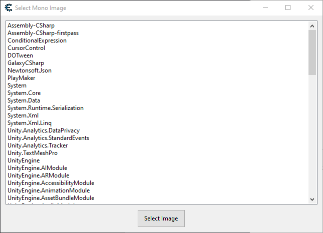
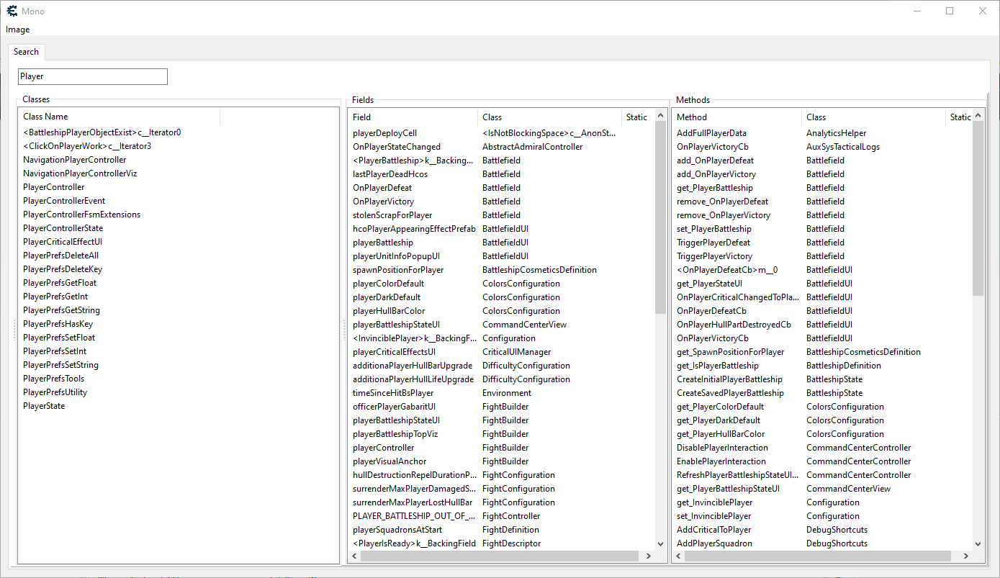

## Cheat Engine Mono Helper

The purpose of this is to make easier to analyze games that use mono.  The default
dissect window is slow and difficult to use.  By fetching all the mono information
up front (in just a few seconds) and storing them in LUA tables it is possible to
do things like auto-complete style instant searching.

> **NOTE** *this is a work in progress, the basic searching works well, but you
have to use the dissect window to do most things still until I can figure out
how to use pop-ups better

To use the new forms, select the new 'Search' option from the mono menu.  The first
time you do this it will open a window to select the image.  I've found that for
mono games you usually want to select `Assembly-CSharp`.  This is much easier here
because the list is sorted by name (unlike the dissect window which is sorted
by address) and it is usually the one at the top.



With the search window you can find things that may be interesting very quickly.
For instance I normally start by typing 'player'.  In the normal dissect window
it helps to select the image first and uncheck 'search entire file', but you still
have to click through 'find' over and over to get to something interesting.

With the search window for Crying Suns I immediately see 'PlayerState' which seems
very interesting.  Other things pop up that could quickly lead to cheats such
as the fields "player" on the "Team" class, playerState on the RunState class, and
playerBattleship on BattlefieldUI.  In methods we can see Configuration.get_InvinciblePlayer,
GameState.get_PlayerState, Battlefield.set_PlayerBattleship, etc.



Double-clicking a class, field, or method will open up a window for the class with
tables for Fields, Methods, and Notes.  The fields will tell you the offset and let
you sort by name or offset in the 'Options' menu.  It also tells you if the field is
STATIC.  That would probably be good for this game to help you write a cheat.   You
can use commands I'm sure to get the address of GameState.currentRunState.  With that
you can get `playerState` at offset 30.


## Hooking a method

Double-clicking a method in the Class window will goto the method's address in
the disassembly window and open up an auto-assembly window with code to hook
into the start of the method.  For example in Crying Suns you can search for
'IsConnectedTo' and double-click on the method in the search window to open
up the NavigationSystem class it belongs to.  Then double-clicking on the method
there will create this script:

```
define(hook,"CryingSuns.Navigation:NavigationSystem:IsConnectedTo")
define(bytes,55 48 8B EC 56)

[enable]

assert(hook, bytes)
alloc(newmem,$1000, hook)
{
  RCX: NavigationSystem (this)
  RDX: CryingSuns.Navigation.NavigationSystem _system

  Returns (RAX) System.Boolean
}

newmem:
  // original code
  push rbp
  mov rbp,rsp
  push rsi
  jmp hook+5

hook:
  jmp newmem

[disable]

hook:
  db bytes

dealloc(newmem)
```

You can replace the original code with this to return true so that you can jump from one system to another:

```
mov rax,1
ret
```

## Static Fields

The script "Register Statics" shows how to register static fields as symbols so you can use them
in your code or in table values.  Here it registers `CryingSuns:GameState:currentRunState` which
is an easy way to find the player state with fuel, commandos, and scrap:

```
[enable]
{$lua}
unregisterSymbol("CryingSuns:GameState:currentRunState")
LaunchMonoDataCollector()
local class = mono_findClass("CryingSuns", "GameState")
for i,f in ipairs(mono_class_enumFields(class)) do
  if f.isStatic and f.name == "currentRunState" then
    registerSymbol("CryingSuns:GameState:currentRunState", mono_class_getStaticFieldAddress(mono_enumDomains()[1], class) + f.offset, true)
    break
  end
end
{$asm}

[disable]
{$lua}
unregisterSymbol("CryingSuns:GameState:currentRunState")
{$asm}
```

## So what now?

Unfortunately this was something I wrote a couple years ago and have forgotten
a lot of the CE lua commands and never figured out how to get pop-up menus to work
how I wanted.  If you find some interesting classes/methods/fields you need to
go to the built-in dissect window, go to 'Assembly-CSharp' and search for the name
you are looking for.

## What I'd like to do in the future:

* Detect/show what are enums
* Right-click class to find instances
* Right-click to create code to find statics
* Show method arguments and return values (method window?)
* Right-click to inject at start of method
    * Create AA script that will inject at start, have comments showing arguments and register/stack locations
* Implement notes on class, method, field
* Notes window showing all notes
* ...